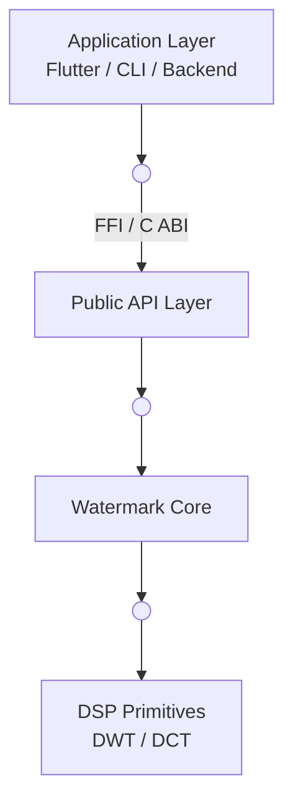
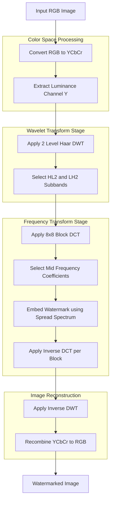
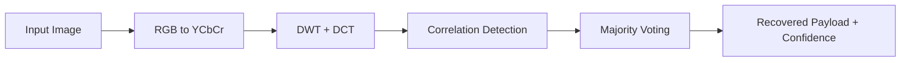

# Screenshot‑Resilient Watermarking Core

## Overview

This repository contains the **core C++ implementation of a screenshot‑resilient, invisible image watermarking pipeline**. The project is designed as a **low‑level, language‑agnostic library** that can be safely embedded into higher‑level environments such as **Flutter/Dart via FFI**, mobile apps, or backend services.

The watermarking system embeds a small, opaque identifier directly into the **image signal** (not metadata), such that it survives:

* Screenshots
* JPEG recompression
* Rescaling
* Moderate cropping

The design prioritizes **determinism, robustness, and clean ABI boundaries** over experimental complexity.

---

## Key Goals

* Invisible watermarking with minimal perceptual impact
* Robust extraction after screenshots and social‑media style processing
* Deterministic behavior (same input + key → same output)
* C‑compatible ABI for safe FFI usage
* Modular DSP pipeline with strong testability

---

## High‑Level Architecture

The system is split into **three strict layers**:



### Layer Responsibilities

| Layer       | Responsibility                                   |
| ----------- | ------------------------------------------------ |
| Application | User interaction, file I/O, UI, networking       |
| Public API  | Stable C ABI, error handling, data marshaling    |
| Core        | Image processing, watermark embedding/extraction |

---

## Pipeline Overview

### Embedding Flow



### Extraction Flow



---

## Technical Approach

### Core Techniques

* **Discrete Wavelet Transform (DWT)**

  * 2‑level Haar wavelet
  * Embedding in HL₂ and LH₂ bands

* **Discrete Cosine Transform (DCT)**

  * 8×8 block‑wise DCT (JPEG‑aligned)
  * Mid‑frequency coefficient selection

* **Spread‑Spectrum Watermarking**

  * Additive PN‑modulated embedding
  * High redundancy + majority voting

* **Error Resilience**

  * 32–64 blocks per bit
  * Accepts extraction if ≥90% bits recover

---

## Repository Structure

```
watermark-core/
├── include/wm/        # Public headers (ABI‑safe)
│   ├── api.h         # C‑compatible API
│   ├── types.h       # Data structures
│   ├── errors.h      # Error codes
│   ├── image.h       # Image adapter
│   ├── params.h      # Parameter definitions
│   └── transform/
│       ├── dct.h
│       └── dwt.h
│
├── src/               # Implementation
│   ├── api.cpp
│   ├── image.cpp
│   ├── transform/
│   └── watermark/
│
├── tests/             # Unit tests
│   ├── test_image.cpp
│   ├── test_dct.cpp
│   └── test_extract.cpp
│
└── examples/
    └── cli.cpp
```

---

## Public API (Stable ABI)

```c
WM_Error wm_embed(
    const WM_ImageBuffer* input,
    const WM_Payload* payload,
    const WM_Key* key,
    const WM_EmbedOptions* options,
    WM_ImageBuffer* output
);

WM_Error wm_extract(
    const WM_ImageBuffer* input,
    const WM_Key* key,
    WM_ExtractResult* result
);
```

All API functions:

* Are **exception‑free**
* Use **explicit error codes**
* Avoid STL types for FFI safety

---

## Build & Test (Current)

### Compile image adapter tests

**PowerShell / Windows**

```powershell
g++ -std=c++17 -Iinclude src/image.cpp tests/test_image.cpp -o test_image.exe
.	est_image.exe
```

**Linux / macOS**

```bash
g++ -std=c++17 -Iinclude src/image.cpp tests/test_image.cpp -o test_image
./test_image
```

---

## Non‑Functional Guarantees

* **Performance**: O(N) time, suitable for mobile CPUs
* **Memory Safety**: Explicit allocation/free, no hidden ownership
* **Determinism**: Fixed PRNG seeds, no global state
* **Portability**: No platform‑specific dependencies

---

## Limitations (v1)

* Limited rotation invariance (±5°)
* No perspective or affine correction
* No cryptographic proof binding yet

These are **intentional exclusions** for v1.

---

## Roadmap

* Haar DWT + DCT primitives (in progress)
* Watermark embed/extract engine
* Extensive attack benchmarking
* Dart FFI bindings
* ZK / cryptographic proof layer (separate module)

---

## License & Usage

This project is intended as a **research‑grade and production‑ready watermarking core**. Licensing and distribution terms should be defined before external release.

---

## Contact / Notes

This repository is part of a larger effort toward **screenshot‑proof media authenticity systems**. Architectural decisions are optimized for correctness and long‑term maintainability rather than short‑term experimentation.
